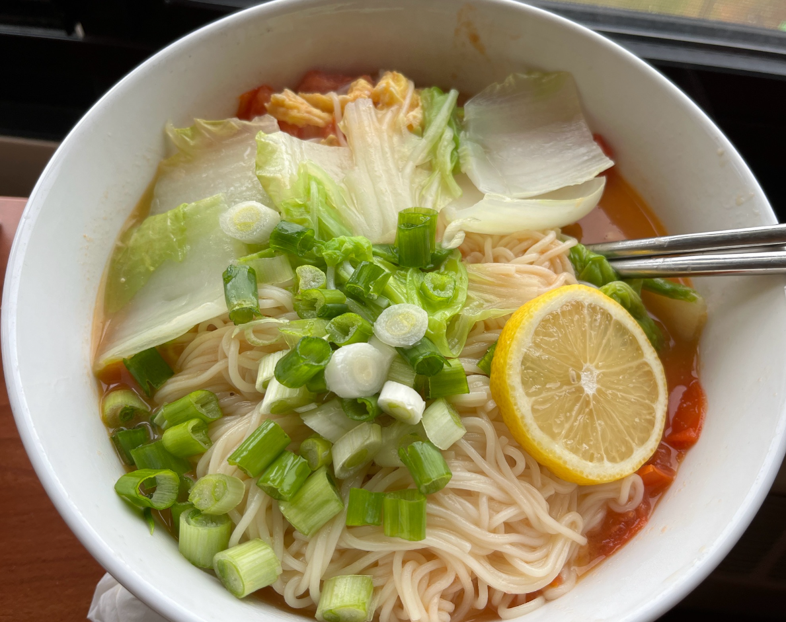

# 北美单人食谱

## 早餐

建议从<干粮>选1份，<干粮>选1份，<补充>选1-2份，<稀饭>选1份

干粮可选项

| 名称                  | 个数  | 购买渠道                                                     |
| --------------------- | ----- | ------------------------------------------------------------ |
| 面包片（可选+芝士片） | 3-4个 | 楼下超市，Walmart，Weee（不推荐），Target，Amazon Whole food |
| 水煮玉米              | 1-2个 | 楼下超市，Walmart，Weee，Target，Amazon Whole food           |
| 蒸馒头                | 1-2个 | Weee，亚超                                                   |

补充可选项

| 名称       | 个数   | 购买渠道                                                    |
| ---------- | ------ | ----------------------------------------------------------- |
| 坚果       | 20-40g | 楼下超市，Walmart（推荐），Target                           |
| 水煮鸡蛋   | 1-2个  | 楼下超市，Walmart，Target，Weee（不推荐），Amazon Wholefood |
| 水煮鹌鹑蛋 | 3-4个  | Weee，亚超                                                  |

稀饭可选项

| 名称                             | 个数         | 购买渠道                          |
| -------------------------------- | ------------ | --------------------------------- |
| （低配版）温热水                 | 400-600ml    | 楼下超市，Walmart，Target，自己烧 |
| （不健康）冷饮-橙汁              | 250-350ml    | 楼下超市，Walmart，Target         |
| 开水冲藕粉                       | 600-800ml    | Weee，亚超                        |
| 开水冲黑芝麻糊                   | 350-600ml    | Weee，亚超                        |
| 泡粥（大米/小米/绿豆/红豆/枸杞） | ~600ml或以上 | Weee，亚超                        |

## 午餐或晚餐 - 素菜

### 番茄鸡蛋

食材：

| 名称      | 个数    | 购买渠道                                                    |
| --------- | ------- | ----------------------------------------------------------- |
| 番茄      | 2-3     | 楼下超市，Walmart（推荐），Target，Weee，Amazon Wholefood   |
| 鸡蛋      | 2-3     | 楼下超市，Walmart，Target，Weee（不推荐），Amazon Wholefood |
| 小葱/大葱 | 0.3-0.5 | 楼下超市，Walmart，Target，Weee，亚超，Amazon Wholefood     |

配料：生抽，盐，黑胡椒粉

第一步：番茄切成小块，鸡蛋打到碗里，加入葱花

第二步：热锅入油，油热后加入鸡蛋

第三步：鸡蛋成型后捞出，下番茄，加入一些盐和生抽翻炒

第四步：番茄出汁快好后加入鸡蛋打碎，搅拌

(附加选项：加入一碗清水，根据口味选择糖/盐/鸡精加入，大火收汁待略微浓稠）

第五步：稍等片刻出锅

### 青菜蘑菇

食材：

| 名称                         | 个数                 | 购买渠道                                                |
| ---------------------------- | -------------------- | ------------------------------------------------------- |
| 青菜/娃娃菜/白菜/茼蒿/卷心菜 | 4-6片大叶或5-8片小叶 | 楼下超市，Walmart，Target，Weee，亚超，Amazon Wholefood |
| 蘑菇/白蘑菇/海鲜菇/信鲍菇    | 4-5个                | 楼下超市，Walmart，Target，Weee，亚超，Amazon Wholefood |
| 小葱/大葱                    | 0.3-0.5              | 楼下超市，Walmart，Target，Weee，亚超，Amazon Wholefood |
| 蒜                           | 2-3个                | 楼下超市，Walmart，Target，Weee，亚超，Amazon Wholefood |

配料：生抽，盐，蚝油，水，醋（可选）

第一步：蔬菜洗净，切成小段；蘑菇切成块/片

第二步：热锅入油，油热后加入葱段/末和蒜小块

第三步：加入菜段和蘑菇块/片，加入盐，适量加入水，等待塌架

第四步：菜和蘑菇塌架后加入小量生抽和蚝油

第五步：稍等2-3分钟出锅

## 午餐或晚餐 - 肉菜

### 芹菜里脊

食材：

| 名称       | 个数       | 购买渠道                                                |
| ---------- | ---------- | ------------------------------------------------------- |
| 芹菜       | 半颗       | Weee，亚超，Target，Walmart，Amazon Wholefood           |
| 里脊肉     | 0.35-0.5榜 | Weee，亚超                                              |
| 小葱/大葱  | 0.3-0.5    | 楼下超市，Walmart，Target，Weee，亚超，Amazon Wholefood |
| 蒜         | 2-3个      | 楼下超市，Walmart，Target，Weee，亚超，Amazon Wholefood |
| 姜（可选） | 4片        | 楼下超市，Walmart，Target，Weee，亚超，Amazon Wholefood |

配料：生抽，老抽，盐，蚝油，水，醋，料酒，玉米/土豆淀粉，十三香，黑胡椒粉

第一步：把里脊肉放入碗中，加入微量十三香，黑胡椒粉；少量老抽，生抽，蚝油，淀粉；中量料酒。加入姜切成的丝，搅拌均匀使里脊肉完全或半浸泡于溶剂中

第二步：芹菜切成小段（可使用并排，concurrent切法）

第三步：热锅入油，油热后加入一半的葱段/末和蒜小块

第四步：芹菜加入锅中，随后加入少量水，生抽；微量醋，翻炒

第五步：稍等3分钟盛出芹菜

第六步：洗锅，热锅入油，油热后加入剩下的葱段/末和蒜小块

第七步：里脊肉和拌料倒入，翻炒大约40秒，随后加入芹菜，再翻炒30秒左右

第八步：出锅

### 青椒肉块

食材：

| 名称      | 个数    | 购买渠道                                                |
| --------- | ------- | ------------------------------------------------------- |
| 青椒      | 1个     | Weee，亚超，Target，Walmart，Amazon Wholefood           |
| 蘑菇      | 2-3个   | 楼下超市，Walmart，Target，Weee，亚超，Amazon Wholefood |
| 猪肉      | ~0.5榜  | Weee，亚超                                              |
| 小葱/大葱 | 0.3-0.5 | 楼下超市，Walmart，Target，Weee，亚超，Amazon Wholefood |
| 蒜        | 2-3个   | 楼下超市，Walmart，Target，Weee，亚超，Amazon Wholefood |
| 姜        | 4片     | 楼下超市，Walmart，Target，Weee，亚超，Amazon Wholefood |
| 辣椒      | 2-3个   | Weee，亚超                                              |

配料：生抽，老抽，盐，蚝油，醋，料酒，玉米/土豆淀粉，十三香，黑胡椒粉

第一步：把猪肉切成小块，放入碗中，加入微量十三香，黑胡椒粉；少量老抽，生抽，耗油，淀粉；中量料酒。加入姜切成的丝，搅拌均匀使肉块完全或半浸泡于溶剂中

第二步：青椒切成丝，蘑菇切成片

第三步：热锅入油，油热后加入一半的葱段/末，辣椒段，和蒜小块

第四步：肉块和拌料加入锅中，翻炒1-2分钟

第五步：加入青椒丝和蘑菇片，翻炒2-6分钟

第六步：出锅

### 冬瓜炖排骨

食材：

| 名称           | 个数                          | 购买渠道                                                |
| -------------- | ----------------------------- | ------------------------------------------------------- |
| 冬瓜或白萝卜   | 1个                           | Weee，亚超                                              |
| 排骨或其它大骨 | 8-12个（排骨）；3-5个（大骨） | Weee，亚超                                              |
| 小葱/大葱      | 0.3-0.5                       | 楼下超市，Walmart，Target，Weee，亚超，Amazon Wholefood |
| 姜             | 4片                           | 楼下超市，Walmart，Target，Weee，亚超，Amazon Wholefood |

配料：生抽，盐，料酒，黑胡椒粉

第一步：排骨切块，排骨/大骨放入锅中加入冷水，开火昭水，加入中量料酒，葱段，姜片，过一会儿后过滤掉白沫

第二步：排骨/大骨冷水冲掉附着白沫，放入炖锅/高压锅

第三步：冬瓜/白萝卜切块，放入炖锅/高压锅

第四步：加入中量生抽，料酒，煮1h（高压锅）或2.5-3.5h（炖锅）

第五步：出锅

### 炸鸡翅

食材：

| 名称      | 个数    | 购买渠道                                                |
| --------- | ------- | ------------------------------------------------------- |
| 鸡翅      | 4-6个   | 楼下超市，Walmart，Target，Weee，亚超，Amazon Wholefood |
| 小葱/大葱 | 0.3-0.5 | 楼下超市，Walmart，Target，Weee，亚超，Amazon Wholefood |
| 姜        | 4片     | 楼下超市，Walmart，Target，Weee，亚超，Amazon Wholefood |

配料：盐，料酒，黑胡椒粉，海鲜调料粉（CAJUN SEASONING），洋葱粉（Onion Powder），（可选）迷迭香粉

额外：锡纸，空气炸锅

第一步：鸡翅切刀口，为了尽可能去腥和入料

第二步：鸡翅和冷水放入锅中，加入中量料酒，葱段，姜，开火煮

第三步：一段时间后（白沫渗出许多后）将鸡翅捞出，厨房纸擦干，兑入适当（因人而异，默认少量各佐料）佐料，用手抓鸡翅使其充分入料

第四步：锡纸上放好鸡翅（铺开），400华氏度正面6-7分钟，反面5分钟

第五步：出锅

### 可乐鸡翅

食材：

| 名称      | 个数    | 购买渠道                                                |
| --------- | ------- | ------------------------------------------------------- |
| 鸡翅      | 6-8个   | 楼下超市，Walmart，Target，Weee，亚超，Amazon Wholefood |
| 小葱      | 1根     | 楼下超市，Walmart，Target，Weee，亚超，Amazon Wholefood |
| 大葱      | 仅白色根部，两片 | 楼下超市，Walmart，Target，Weee，亚超，Amazon Wholefood |
| 姜        | 4-6片   | 楼下超市，Walmart，Target，Weee，亚超，Amazon Wholefood |
| 花椒      | 3-4个   | unknown |
| 冰糖      | 4-5颗   | unknown |
| 蒜瓣      | 1-2个   | unknown |
| 可乐      | 330ml装 2-2.5罐 | unknown |

配料：盐，料酒，鸡精/味精，生抽，老抽，酱油

第一步：鸡翅切刀口，加入料酒和生抽腌制25分钟以上，将大葱小葱姜切片（小葱可以选择不切），蒜瓣排扁
第二步：将鸡翅的腌汁倒干净，热锅烧油下姜片爆香
第三步：爆香之后的姜片倒掉，但是不要把油倒掉，将鸡翅放入锅中大火翻炒1分钟左右，防止粘锅
第四步：小火/中火煎6分钟，中间记得反面
第五步：加入可乐大火烧开，烧开后撇去黑色浮沫
第六步：加入准备好的葱姜蒜，之后调味，加入两勺生抽两勺酱油一勺老抽，4-5颗冰糖和适量味精/鸡精和少许盐
第七步：烧开之后转中火盖上盖子烧30分钟左右
第八步：待锅中汤汁偏少时打开锅盖大火收汁，汤汁浓稠后出锅（记得给鸡翅翻面避免粘锅）

## 特殊餐

### 方便面

食材：

| 名称   | 个数 | 购买渠道   |
| ------ | ---- | ---------- |
| 方便面 | 一袋 | Weee，亚超 |

第一步：方便面入碗，料包全部倒入

第二步：热水冲泡浸没

第三步：盖上一个盘子，等待3-5分钟

### 煮饺子

食材：

| 名称 | 个数      | 购买渠道   |
| ---- | --------- | ---------- |
| 水饺 | 0.7-1.0袋 | Weee，亚超 |

第一步：开水后饺子入锅

第二步：煮8-12分钟，（可选）半掩锅盖

第三步：出锅

### 番茄鸡蛋面

参考食材：见上面的“番茄鸡蛋”

额外食材：

| 名称         | 个数   | 购买渠道                                                |
| ------------ | ------ | ------------------------------------------------------- |
| 面条         | 看胃口 | Weee，亚超                                              |
| 菜叶（可选） | 1-3片  | 楼下超市，Walmart，Target，Weee，亚超，Amazon Wholefood |
| 柠檬（可选） | 1片    | 楼下超市，Walmart，Target，Weee，亚超，Amazon Wholefood |

第零步：完成上面的“番茄鸡蛋”所有步骤

第一步：开水入锅，加入面条，煮8-12分钟。（可选）一同加入菜叶煮

第二步：面条出锅和番茄鸡蛋汤汁，加入微量生抽和耗油搅拌

第三步：加入点缀的柠檬片

### 自制火锅

食材：

| 名称               | 个数                            | 购买渠道                                                |
| ------------------ | ------------------------------- | ------------------------------------------------------- |
| 火锅料             | 1-1.5                           | Weee，亚超                                              |
| 玉米               | 1个                             | 楼下超市，Walmart，Weee，Target，Amazon Whole food      |
| 蘑菇/海鲜菇/信鲍菇 | 3-5（海鲜/信鲍菇）；6-8（蘑菇） | 楼下超市，Walmart，Target，Weee，亚超，Amazon Wholefood |
| 毛肚               | 一袋（小），或5-8片             | Weee，亚超                                              |
| 牛肉卷             | 半盒                            | Weee，亚超                                              |
| 鱼丸               | 3-5个                           | Weee，亚超                                              |
| 冻豆腐             | 1小盒                           | Weee，亚超                                              |
| 豆腐皮（丝）       | 1小袋                           | Weee，亚超                                              |
| 菜叶（可选）       | 1-3片                           | 楼下超市，Walmart，Target，Weee，亚超，Amazon Wholefood |
| 面条（可选）       | 看剩下食量                      | Weee，亚超                                              |

第零步：根据火锅料，决定是否翻炒料

第一步：玉米切段，菇切片，全放入锅中，加入底料，加入开水

第二步：开锅，水开后继续煮其余食材

## 饭店推荐

#### 香港香格里拉酒店自助早餐

理由：入（大陆）境前必备，样式很多，中西都有，奶昔+果冻颗粒和米线都非常好吃

#### 芝加哥海底捞

理由：相对好吃的北美火锅店，汤底和食材都还可以

